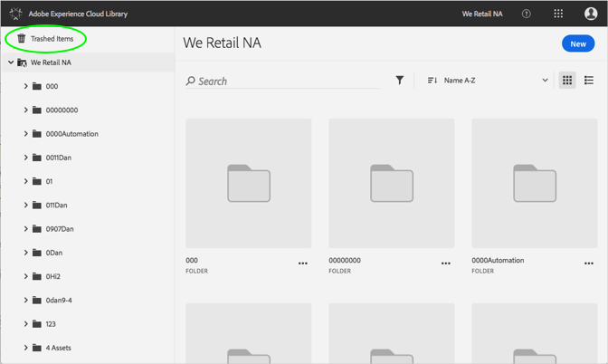
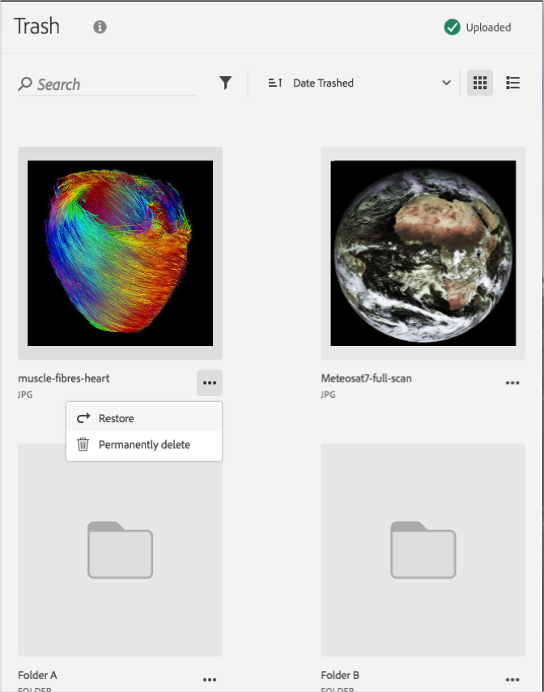

# 永久刪除已清除的資產{#permanently-delete-a-trashed-asset}

您可以在 Adobe Experience Cloud 資料庫中永久刪除已清除的資產。

項目清除後，該項目仍會在 Experience Cloud 資料庫的「已清除的項目」區域中存留 60 天。如果您未還原項目，Experience Cloud 資料庫會在 60 天後將其永久刪除。

您可以在 60 天內永久刪除已清除的資產，方法如下:

1. 按一下&#x200B;**[!UICONTROL 「已清除的項目」]**。

   

1. 按一下一或多個要永久刪除的項目。
1. 按一下&#x200B;**[!UICONTROL 「更多資訊 > 永久刪除」]**。

   

1. 確認您要將選取的資產永久刪除。

