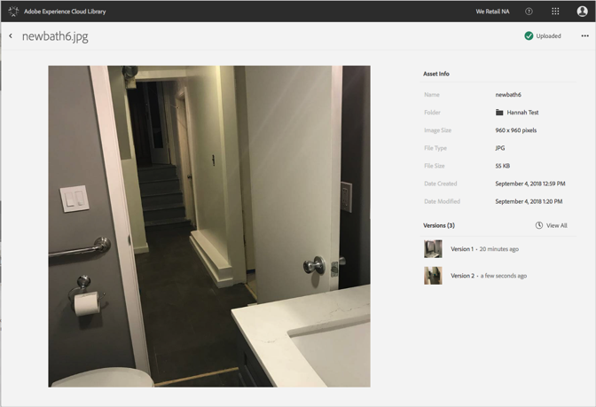
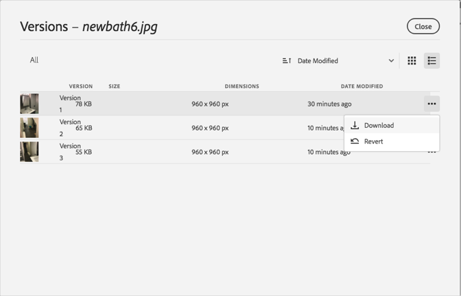

# 回復成舊版資產{#revert-to-an-older-version-of-an-asset}

您可以將 Adobe Experience Cloud 資料庫中的資產回復成較舊的版本。

若要將 Experience Cloud 資料庫中的資產回復成較舊的版本:

1. 按一下資產。
1. 按一下資產旁的&#x200B;**[!UICONTROL 更多選項]**&#x200B;選單 (刪節號)。

   

1. 按一下&#x200B;**[!UICONTROL 「資產詳細資料」]**。
1. 按一下「版本」旁的&#x200B;**[!UICONTROL 「全部檢視」]**，查看所有資產版本。

   

1. 在版本清單中，找到要回復的版本，並按一下旁邊的&#x200B;**[!UICONTROL 更多選項]**&#x200B;選單 (刪節號)。

   

1. 按一下&#x200B;**[!UICONTROL 「回復」]**。

此時的版本即為您想回復的版本。
