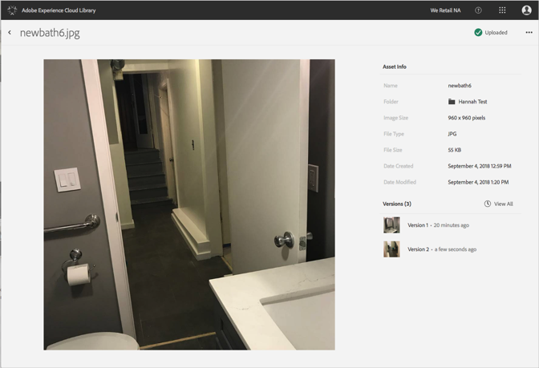

# 檢視資產的舊版本{#view-previous-versions-of-an-asset}

您可以在 Adobe Experience Cloud 資料庫中檢視資產的舊版本。

若要在 Experience Cloud 資料庫中檢視資產的舊版本:

1. 選取資產。
1. 選取資產旁的&#x200B;**[!UICONTROL 更多選項]**&#x200B;選單 (刪節號)。

   

1. 選取&#x200B;**[!UICONTROL 「資產詳細資訊」]**。
1. 選取「版本」旁的&#x200B;**[!UICONTROL 「全部檢視」]**，即可查看資產的所有版本。

   

