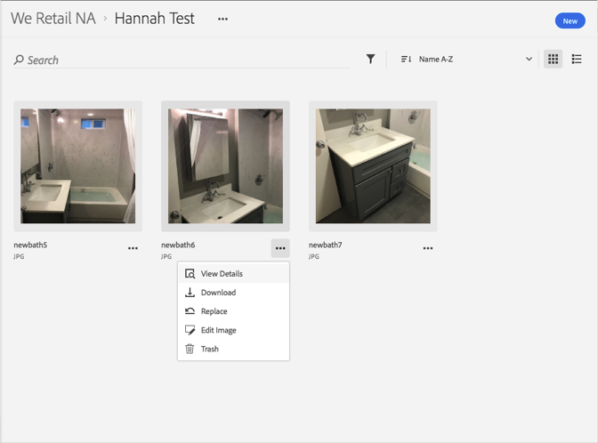

# 汰換資產{#replace-an-asset}

您可以在 Adobe Experience Cloud 資料庫中汰換資產。

若要在 Experience Cloud 資料庫中汰換資產:

1. 按一下資產。
1. 按一下資產旁的&#x200B;**[!UICONTROL 更多選項]**&#x200B;選單 (刪節號)。

   

1. 按一下&#x200B;**[!UICONTROL 「取代」]**。
1. 選取要取代舊資產的新資產。

