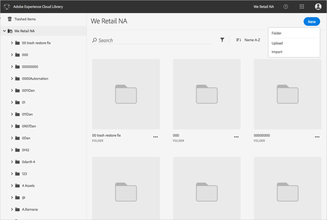

# 建立資料夾{#create-a-folder}

您可以在 Adobe Experience Cloud 資料庫中建立資料夾，以便整理資產。

若要在 Experience Cloud 資料庫中建立資料夾:

1. 選取&#x200B;**[!UICONTROL 「新增]** &gt; **[!UICONTROL 資料夾」]**。

   

1. 輸入資料夾的名稱，然後選取&#x200B;**[!UICONTROL 「建立」]**。

