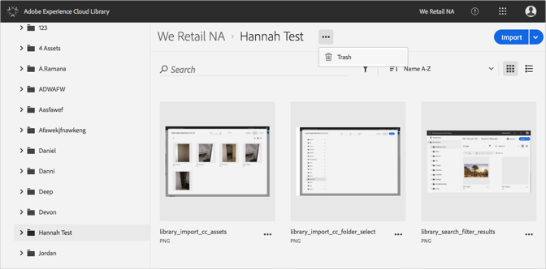
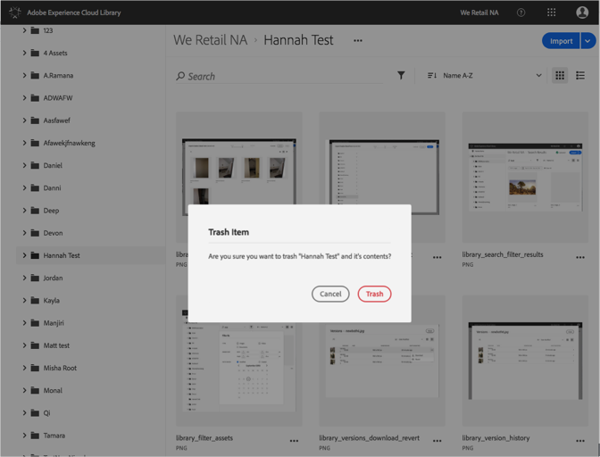

# 垃圾筒{#trash-a-folder}

您可以在Adobe Experience Cloud Library中銷毀資料夾。

若要刪除Experience Cloud Library中的資料夾：

1. 按一下資料夾至垃圾筒。
1. 按一下 **[!UICONTROL 更多選項功能表]** (橢圓形)，然後選取 **[!UICONTROL 垃圾筒]**。

   

1. 確認您要刪除資料夾。

   

