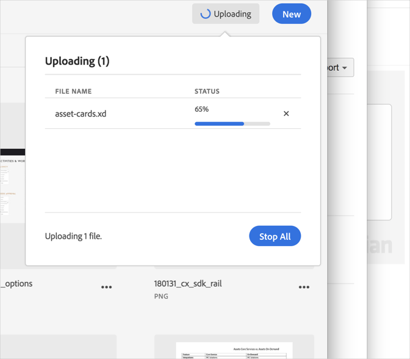

# 取消上傳{#cancel-an-upload}

如果您選取了不正確或太大的檔案，請取消裝置上的上傳至Adobe Experience Cloud Library。

取消已開始的上傳：

1. 按一下通知指標。
1. 按一下 **** 「全部停止」以停止所有下載，或按一下個別檔案旁 **[!UICONTROL 的X]** 以取消。

   

如果您選取一或多個同名的檔案，Experience Cloud Library會提示您取代舊版本或保留新版本。
