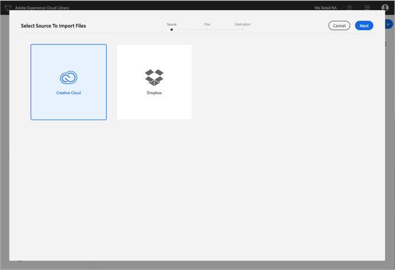
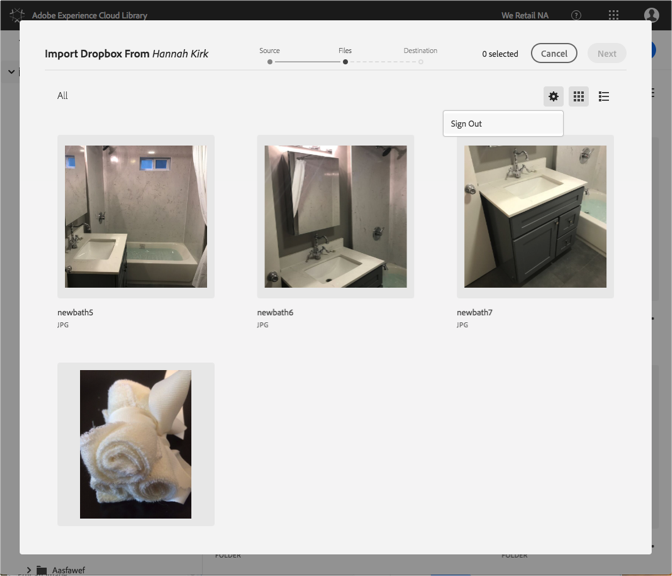

# 變更Dropbox或Creative Cloud帳戶{#change-dropbox-or-creative-cloud-accounts}

切換至不同的Dropbox或Creative Cloud帳戶，將內容新增至Adobe Experience Cloud Library。

當您登入Dropbox或Creative Cloud帳戶後，除非您登出或切換帳戶，否則您將持續登入。

若要切換至不同的Dropbox或Creative Cloud帳戶：

1. 選擇 **[!UICONTROL 「新增]** &gt; **[!UICONTROL 匯入]**」。

   

1. 選擇 **[!UICONTROL Creative Cloud]** 或 **[!UICONTROL Dropbox]**。

   

1. 選擇 **[!UICONTROL 「下]**&#x200B;一步」。
1. 選取右上角的齒輪圖示。

   

1. 選擇 **[!UICONTROL 「登出]**」。
1. 登入其他帳戶。

