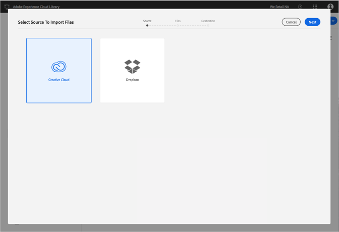

# 將 Creative Cloud 檔案匯入 Adobe Experience Cloud 資料庫{#import-creative-cloud-files-into-the-adobe-experience-cloud-library}

將 Creative Cloud 中的檔案匯入 Adobe Experience Cloud 資料庫，以便從任何 Adobe Experience Cloud 產品管理這些檔案。

>[!NOTE]
>
>您必須先建立資料夾，才能執行此工作。

若要將 Creative Cloud 檔案匯入 Experience Cloud 資料庫中:

1. 選取&#x200B;**[!UICONTROL 「新增]** &gt; **[!UICONTROL 匯入」]**。

   

1. 選取 **[!UICONTROL Creative Cloud]**。

   如果您尚未登入 Creative Cloud 帳戶，請先登入。

   

1. 按&#x200B;**[!UICONTROL 「下一步」]**。
1. 選取一或多個要匯入的檔案。

   

1. 按&#x200B;**[!UICONTROL 「下一步」]**。
1. 選取要放置資產的資料夾。

   >[!NOTE]
   >
   >您可以選擇要存放匯入資產的資料夾。若要將檔案放置在不同的資料夾，請對每個資料夾重複此步驟。

   

1. 按一下&#x200B;**[!UICONTROL 「匯入」]**。

