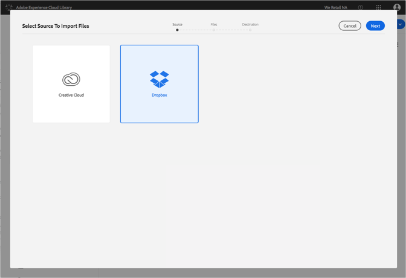
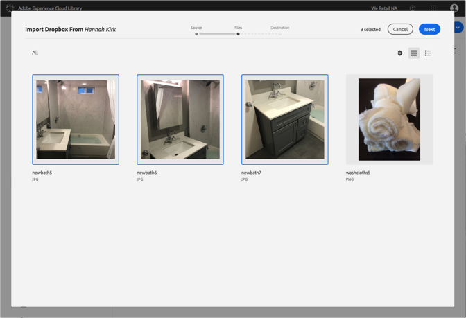
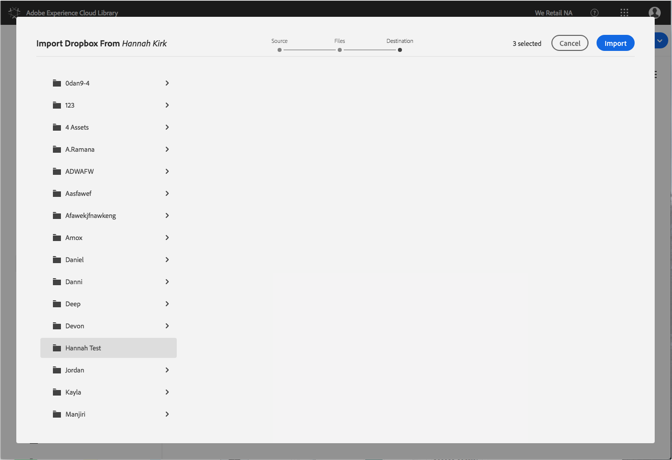

# 將Dropbox檔案匯入Adobe Experience Cloud Library{#import-dropbox-files-into-the-adobe-experience-cloud-library}

從Dropbox匯入檔案至Adobe Experience Cloud Library，以便從任何Adobe Experience Cloud產品中管理。

>[!NOTE]
>
>您必須先建立檔案夾，才能執行此工作。

若要將Dropbox檔案匯入Experience Cloud Library：

1. 選擇 **[!UICONTROL 「新增]** &gt; **[!UICONTROL 匯入]**」。

   

1. 選取 **[!UICONTROL Dropbox]**。

   如果您尚未登入，請登入Dropbox帳戶。

   

1. Click **[!UICONTROL Next]**.
1. 選取要匯入的一或多個檔案。

   

1. Click **[!UICONTROL Next]**.
1. 選取放置資產的資料夾。

   >[!NOTE]
   >
   >您可以選擇要匯入資產的一個資料夾。若要將檔案放置在不同的檔案夾中，請對每個資料夾重復此項工作。

   

1. Click **[!UICONTROL Import]**.

