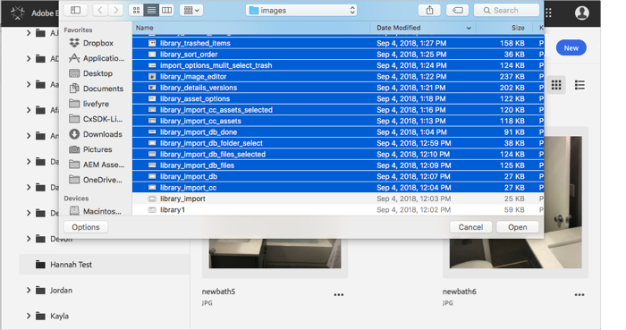
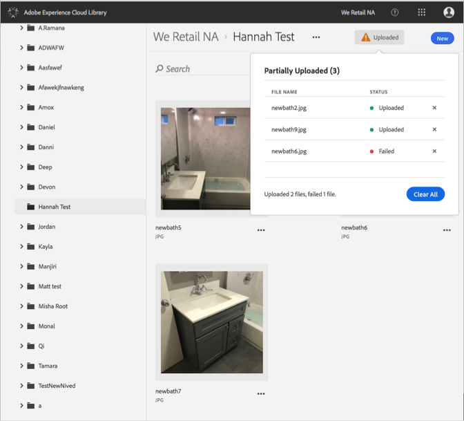

# 從裝置上傳資產{#upload-asset-from-device}

從您的裝置上傳資產，以便在 Adobe Experience Cloud 資料庫中管理這些資產。

若要將您裝置中的資產上傳至 Experience Cloud 資料庫:

1. 選取 **[!UICONTROL 新增]** > **[!UICONTROL 上傳]**.

   

1. 選取要上傳至 Experience Cloud 資料庫的資產。

   

1. 檔案上傳完成後，通知方塊會顯示確認或任何錯誤訊息。

   

